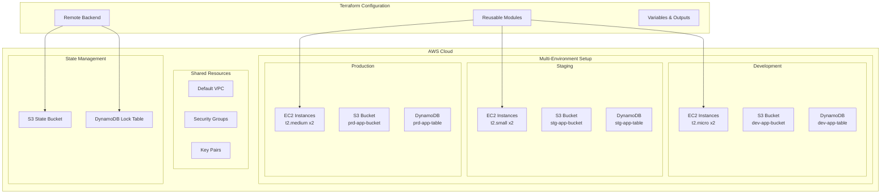

# Terraform DevOps Infrastructure Project


A comprehensive Terraform project for deploying and managing AWS infrastructure across multiple environments. This project demonstrates Infrastructure as Code (IaC) best practices with modular architecture, state management, and multi-environment support.

## 📋 Table of Contents

- [🏗️ Architecture](#️-architecture)
- [📁 Project Structure](#-project-structure)
- [🚀 Quick Start](#-quick-start)
- [⚙️ Configuration](#️-configuration)
- [🌍 Multi-Environment Setup](#-multi-environment-setup)
- [🧩 Modules](#-modules)
- [📦 Resources](#-resources)
- [🚢 Deployment](#-deployment)
- [📤 Outputs](#-outputs)
- [🔒 Security](#-security)
- [🔧 Troubleshooting](#-troubleshooting)
- [📚 Best Practices](#-best-practices)

## 🏗️ Architecture



## 📁 Project Structure

```plaintext
terraform-devops/
├── 📁 aws_module_project/           # Modular infrastructure setup
│   ├── 📄 main.tf                  # Module instantiation for all environments
│   ├── 📄 backend_infra.tf         # Backend resources (S3 + DynamoDB)
│   ├── 📄 providers.tf             # AWS provider configuration
│   ├── 📄 terraform.tf             # Terraform and provider requirements
│   └── 📁 my_app_infra_module/     # Reusable infrastructure module
│       ├── 📄 variables.tf         # Module input variables
│       ├── 📄 my_server.tf         # EC2 instance configuration
│       ├── 📄 my_bucket.tf         # S3 bucket configuration
│       └── 📄 my_table.tf          # DynamoDB table configuration
├── 📄 main.tf                      # Root module (standalone resources)
├── 📄 variables.tf                 # Global variables
├── 📄 outputs.tf                   # Output definitions
├── 📄 terraform.tf                 # Terraform configuration
├── 📄 ec2.tf                       # EC2 instances and security groups
├── 📄 s3.tf                        # S3 bucket configuration
├── 📄 dynamodb.tf                  # DynamoDB table configuration
└── 📄 README.md                    # This documentation
```

### Key Components

| Component | Purpose | Location
|-----|-----|-----
| **Modular Setup** | Multi-environment infrastructure | `aws_module_project/`
| **Standalone Setup** | Single environment resources | Root directory
| **Reusable Module** | Common infrastructure patterns | `my_app_infra_module/`
| **State Management** | Remote state and locking | `backend_infra.tf`


## 🚀 Quick Start

### Prerequisites

Ensure you have the following tools installed:

- **Terraform** >= 1.0
- **AWS CLI** >= 2.0
- **Git**
- **SSH Key Pair** for EC2 access


### Installation

1. **Clone the repository**

```shellscript
git clone https://github.com/shridarchandan/terraform-devops.git
cd terraform-devops
```


2. **Configure AWS credentials**

```shellscript
aws configure
# Enter your AWS Access Key ID, Secret Access Key, and region
```


3. **Generate SSH key pair** (if not exists)

```shellscript
ssh-keygen -t rsa -b 4096 -f terra-key
# This creates terra-key (private) and terra-key.pub (public)
```


4. **Initialize Terraform**

```shellscript
terraform init
```


5. **Plan and apply**

```shellscript
# Review the plan
terraform plan

# Apply changes
terraform apply
```


## ⚙️ Configuration

### Environment Variables

Set the following environment variables for different configurations:

```shellscript
# AWS Configuration
export AWS_REGION="us-east-2"
export AWS_PROFILE="default"

# Terraform Configuration
export TF_VAR_my_enviroment="dev"
export TF_VAR_instance_type="t2.micro"
```

### Variable Customization

Create a `terraform.tfvars` file for custom values:

```terraform
# terraform.tfvars
aws_region      = "us-east-2"
ami_id          = "ami-085f9c64a9b75eed5"
instance_type   = "t2.micro"
my_enviroment   = "dev"
```

### Backend Configuration

Update the backend configuration in `terraform.tf`:

```terraform
terraform {
  backend "s3" {
    bucket         = "your-unique-state-bucket-name"
    key            = "terraform.tfstate"
    region         = "us-east-2"
    dynamodb_table = "your-state-lock-table"
  }
}
```

## 🌍 Multi-Environment Setup

The project supports three environments with different configurations:

| Environment  | Instance Type | Instance Count | Use Case                |
|--------------|---------------|----------------|-------------------------|
| **Development** | `t2.micro`   | 2              | Development and testing |
| **Staging**     | `t2.small`   | 2              | Pre-production validation |
| **Production**  | `t2.medium`  | 2              | Production workloads    |


### Environment-Specific Resources

Each environment creates:

- **EC2 Instances**: 2 instances with environment-specific sizing
- **S3 Bucket**: `{env}-tws-demo-app-bucket`
- **DynamoDB Table**: `{env}-tws-demo-app-table`
- **Security Groups**: Shared across environments
- **Key Pairs**: Shared across environments


## 🧩 Modules

### App Infrastructure Module

**Location**: `aws_module_project/my_app_infra_module/`

This reusable module creates a complete application infrastructure stack.

#### Module Inputs

| Variable      | Type   | Description          | Default  |
|---------------|--------|----------------------|----------|
| `my_env`      | string | Environment name     | Required |
| `instance_type`| string | EC2 instance type    | Required |
| `ami`         | string | AMI ID for instances | Required |


#### Module Resources

1. **EC2 Instances** (`my_server.tf`)

```terraform
resource "aws_instance" "my_app_server" {
  count         = 2
  ami           = var.ami
  instance_type = var.instance_type
  tags = {
    Name = "${var.my_env}-tws-demo-app-server"
  }
}
```


2. **S3 Bucket** (`my_bucket.tf`)

```terraform
resource "aws_s3_bucket" "my_app_bucket" {
  bucket = "${var.my_env}-tws-demo-app-bucket"
  tags = {
    Name = "${var.my_env}-tws-demo-app-bucket"
  }
}
```


3. **DynamoDB Table** (`my_table.tf`)

```terraform
resource "aws_dynamodb_table" "my_app_table" {
  name         = "${var.my_env}-tws-demo-app-table"
  billing_mode = "PAY_PER_REQUEST"
  hash_key     = "userID"
  
  attribute {
    name = "userID"
    type = "S"
  }
}
```


#### Module Usage

```terraform
module "dev-app" {
  source        = "./my_app_infra_module"
  my_env        = "dev"
  instance_type = "t2.micro"
  ami           = "ami-007855ac798b5175e"
}
```

## 📦 Resources

### EC2 Instances

**Configuration:**

- **AMI**: Ubuntu 22.04 LTS (configurable)
- **Instance Types**: Environment-specific sizing
- **Security**: Custom security group with controlled access
- **Storage**: 10GB GP3 root volume
- **Access**: SSH key pair authentication


**Security Group Rules:**

```terraform
# SSH Access (Port 22)
ingress {
  from_port   = 22
  to_port     = 22
  protocol    = "tcp"
  cidr_blocks = ["0.0.0.0/0"]  # Restrict in production!
}

# HTTP Access (Port 80)
ingress {
  from_port   = 80
  to_port     = 80
  protocol    = "tcp"
  cidr_blocks = ["0.0.0.0/0"]
}

# HTTPS Access (Port 443)
ingress {
  from_port   = 443
  to_port     = 443
  protocol    = "tcp"
  cidr_blocks = ["0.0.0.0/0"]
}
```

### S3 Buckets

**State Management Bucket:**

- **Name**: `tws-demo-state-bucket`
- **Purpose**: Terraform state storage
- **Features**: Versioning enabled (recommended)


**Application Buckets:**

- **Naming**: `{environment}-tws-demo-app-bucket`
- **Purpose**: Application data storage
- **Access**: Private by default


### DynamoDB Tables

**State Locking Table:**

- **Name**: `tws-demo-state-table`
- **Purpose**: Terraform state locking
- **Key**: `LockID` (String)
- **Billing**: Pay-per-request


**Application Tables:**

- **Naming**: `{environment}-tws-demo-app-table`
- **Purpose**: Application data storage
- **Key**: `userID` (String)
- **Billing**: Pay-per-request


## 🚢 Deployment

### Option 1: Standalone Deployment

Deploy individual resources using the root configuration:

```shellscript
# 1. Initialize Terraform
terraform init

# 2. Validate configuration
terraform validate

# 3. Plan deployment
terraform plan -var="my_enviroment=dev"

# 4. Apply changes
terraform apply -var="my_enviroment=dev"

# 5. Confirm deployment
# Type 'yes' when prompted
```

### Option 2: Modular Deployment

Deploy using the modular approach for all environments:

```shellscript
# Navigate to module directory
cd aws_module_project

# 1. Initialize Terraform
terraform init

# 2. Plan deployment (all environments)
terraform plan

# 3. Apply changes
terraform apply

# 4. Confirm deployment
# Type 'yes' when prompted
```

### Environment-Specific Deployment

Deploy specific environments:

```shellscript
# Development environment
terraform apply -target=module.dev-app

# Staging environment
terraform apply -target=module.stg-app

# Production environment
terraform apply -target=module.prd-app
```

### Deployment Verification

After deployment, verify resources:

```shellscript
# Check EC2 instances
aws ec2 describe-instances --filters "Name=tag:Name,Values=*tws-demo-app-server*"

# Check S3 buckets
aws s3 ls | grep tws-demo

# Check DynamoDB tables
aws dynamodb list-tables | grep tws-demo
```

## 📤 Outputs

The project provides useful outputs after deployment:

### Available Outputs

```shellscript
# View all outputs
terraform output

# Specific outputs
terraform output public_ip
terraform output arn
```

**Output Values:**

- `public_ip`: Public IP address of the main EC2 instance
- `arn`: Amazon Resource Name of the EC2 instance


### Custom Outputs

Add custom outputs in `outputs.tf`:

```terraform
output "s3_bucket_name" {
  description = "Name of the S3 bucket"
  value       = aws_s3_bucket.testbucket.bucket
}

output "dynamodb_table_name" {
  description = "Name of the DynamoDB table"
  value       = aws_dynamodb_table.my_app_table.name
}

output "security_group_id" {
  description = "ID of the security group"
  value       = aws_security_group.allow_user_to_connect.id
}
```

## 🔒 Security

### Security Best Practices

#### 1. SSH Access Restriction

**Current**: Open to all IPs (`0.0.0.0/0`)
**Recommended**: Restrict to specific IP ranges

```terraform
ingress {
  from_port   = 22
  to_port     = 22
  protocol    = "tcp"
  cidr_blocks = ["YOUR_IP/32"]  # Replace with your IP
}
```

#### 2. IAM Roles and Policies

Create specific IAM roles for EC2 instances:

```terraform
resource "aws_iam_role" "ec2_role" {
  name = "ec2-app-role"
  
  assume_role_policy = jsonencode({
    Version = "2012-10-17"
    Statement = [
      {
        Action = "sts:AssumeRole"
        Effect = "Allow"
        Principal = {
          Service = "ec2.amazonaws.com"
        }
      }
    ]
  })
}
```

#### 3. S3 Bucket Security

Enable versioning and encryption:

```terraform
resource "aws_s3_bucket_versioning" "state_bucket_versioning" {
  bucket = aws_s3_bucket.my_state_bucket.id
  versioning_configuration {
    status = "Enabled"
  }
}

resource "aws_s3_bucket_server_side_encryption_configuration" "state_bucket_encryption" {
  bucket = aws_s3_bucket.my_state_bucket.id
  
  rule {
    apply_server_side_encryption_by_default {
      sse_algorithm = "AES256"
    }
  }
}
```

#### 4. DynamoDB Security

Enable point-in-time recovery:

```terraform
resource "aws_dynamodb_table" "my_app_table" {
  # ... existing configuration ...
  
  point_in_time_recovery {
    enabled = true
  }
}
```

### Security Checklist

- **Restrict SSH access** to specific IP ranges
- **Use IAM roles** instead of hardcoded credentials
- **Enable S3 bucket versioning** and encryption
- **Enable DynamoDB point-in-time recovery**
- **Use HTTPS** for all web traffic
- **Regularly rotate** SSH keys and access keys
- **Monitor access logs** and set up alerts
- **Use AWS Secrets Manager** for sensitive data


## 🔧 Troubleshooting

### Common Issues and Solutions

#### 1. State Lock Errors

**Problem**: Terraform state is locked

```plaintext
Error: Error acquiring the state lock
```

**Solution**:

```shellscript
# List locks
terraform force-unlock -help

# Force unlock (use with extreme caution)
terraform force-unlock LOCK_ID
```

#### 2. Provider Version Conflicts

**Problem**: Provider version mismatch

```plaintext
Error: Failed to query available provider packages
```

**Solution**:

```shellscript
# Upgrade providers
terraform init -upgrade

# Or specify exact versions in terraform.tf
terraform {
  required_providers {
    aws = {
      source  = "hashicorp/aws"
      version = "~> 5.0"
    }
  }
}
```

#### 3. Resource Already Exists

**Problem**: Resource conflicts with existing infrastructure

```plaintext
Error: resource already exists
```

**Solutions**:

```shellscript
# Option 1: Import existing resource
terraform import aws_instance.testinstance i-1234567890abcdef0

# Option 2: Remove from state (dangerous)
terraform state rm aws_instance.testinstance

# Option 3: Use different resource names
```

#### 4. Access Denied Errors

**Problem**: Insufficient AWS permissions

```plaintext
Error: AccessDenied: User is not authorized
```

**Solutions**:

1. **Check AWS credentials**:

```shellscript
aws sts get-caller-identity
aws configure list
```


2. **Verify IAM permissions**:

1. EC2 full access
2. S3 full access
3. DynamoDB full access
4. IAM permissions for role creation


3. **Check AWS region**:

```shellscript
aws configure get region
```


#### 5. AMI Not Found

**Problem**: Specified AMI doesn't exist in region

```plaintext
Error: InvalidAMIID.NotFound
```

**Solution**:

```shellscript
# Find available AMIs
aws ec2 describe-images \
  --owners amazon \
  --filters "Name=name,Values=ubuntu/images/hvm-ssd/ubuntu-jammy-22.04-amd64-server-*" \
  --query 'Images[*].[ImageId,Name]' \
  --output table
```

### Debugging Commands

```shellscript
# Enable detailed logging
export TF_LOG=DEBUG
export TF_LOG_PATH=terraform.log

# Validate configuration
terraform validate

# Format code
terraform fmt -recursive

# Check for security issues (requires tfsec)
tfsec .

# Plan with detailed output
terraform plan -detailed-exitcode

# Show current state
terraform show

# List resources in state
terraform state list

# Show specific resource
terraform state show aws_instance.testinstance
```

### Recovery Procedures

#### State File Recovery

```shellscript
# Backup current state
cp terraform.tfstate terraform.tfstate.backup

# Pull remote state
terraform state pull > terraform.tfstate.backup

# Push local state to remote
terraform state push terraform.tfstate
```

#### Resource Recovery

```shellscript
# Refresh state from actual infrastructure
terraform refresh

# Import missing resources
terraform import aws_instance.testinstance i-1234567890abcdef0

# Recreate resources
terraform apply -replace=aws_instance.testinstance
```

## 📚 Best Practices

### Code Organization

#### 1. File Structure

```plaintext
terraform-project/
├── environments/
│   ├── dev/
│   ├── staging/
│   └── production/
├── modules/
│   ├── compute/
│   ├── storage/
│   └── networking/
├── shared/
│   ├── variables.tf
│   └── outputs.tf
└── scripts/
    ├── deploy.sh
    └── destroy.sh
```

#### 2. Naming Conventions

```terraform
# Resource naming: {environment}-{service}-{resource-type}
resource "aws_instance" "web_server" {
  tags = {
    Name        = "${var.environment}-web-server"
    Environment = var.environment
    Project     = var.project_name
    Owner       = var.owner
  }
}
```

#### 3. Variable Management

```terraform
# Use terraform.tfvars for environment-specific values
# terraform.tfvars
environment    = "production"
instance_type  = "t3.medium"
min_size      = 2
max_size      = 10

# Use .tfvars files for different environments
# dev.tfvars, staging.tfvars, prod.tfvars
```

### State Management

#### 1. Remote State Configuration

```terraform
terraform {
  backend "s3" {
    bucket         = "your-terraform-state-bucket"
    key            = "environments/production/terraform.tfstate"
    region         = "us-east-2"
    dynamodb_table = "terraform-state-locks"
    encrypt        = true
  }
}
```

#### 2. State Locking

Always use DynamoDB for state locking in team environments:

```terraform
resource "aws_dynamodb_table" "terraform_locks" {
  name           = "terraform-state-locks"
  billing_mode   = "PAY_PER_REQUEST"
  hash_key       = "LockID"

  attribute {
    name = "LockID"
    type = "S"
  }

  tags = {
    Name = "Terraform State Locks"
  }
}
```

### Security Practices

#### 1. Secrets Management

```terraform
# Use AWS Secrets Manager
data "aws_secretsmanager_secret_version" "db_password" {
  secret_id = "prod/database/password"
}

# Use random passwords
resource "random_password" "db_password" {
  length  = 16
  special = true
}
```

#### 2. Least Privilege Access

```terraform
# Create specific IAM policies
resource "aws_iam_policy" "app_policy" {
  name = "app-specific-policy"
  
  policy = jsonencode({
    Version = "2012-10-17"
    Statement = [
      {
        Effect = "Allow"
        Action = [
          "s3:GetObject",
          "s3:PutObject"
        ]
        Resource = "${aws_s3_bucket.app_bucket.arn}/*"
      }
    ]
  })
}
```

### Monitoring and Alerting

#### 1. CloudWatch Integration

```terraform
resource "aws_cloudwatch_metric_alarm" "high_cpu" {
  alarm_name          = "${var.environment}-high-cpu-utilization"
  comparison_operator = "GreaterThanThreshold"
  evaluation_periods  = "2"
  metric_name         = "CPUUtilization"
  namespace           = "AWS/EC2"
  period              = "120"
  statistic           = "Average"
  threshold           = "80"
  alarm_description   = "This metric monitors ec2 cpu utilization"
  
  dimensions = {
    InstanceId = aws_instance.testinstance.id
  }
}
```

#### 2. Cost Monitoring

```terraform
resource "aws_budgets_budget" "monthly_budget" {
  name         = "${var.environment}-monthly-budget"
  budget_type  = "COST"
  limit_amount = "100"
  limit_unit   = "USD"
  time_unit    = "MONTHLY"
  
  cost_filters = {
    Tag = ["Environment:${var.environment}"]
  }
}
```

### Testing and Validation

#### 1. Pre-commit Hooks

```shellscript
# .pre-commit-config.yaml
repos:
  - repo: https://github.com/antonbabenko/pre-commit-terraform
    rev: v1.77.0
    hooks:
      - id: terraform_fmt
      - id: terraform_validate
      - id: terraform_tflint
```

#### 2. Automated Testing

```shellscript
# test.sh
#!/bin/bash
set -e

echo "Running Terraform validation..."
terraform validate

echo "Running security scan..."
tfsec .

echo "Running linting..."
tflint

echo "All tests passed!"
```

### Performance Optimization

#### 1. Resource Tagging Strategy

```terraform
locals {
  common_tags = {
    Environment   = var.environment
    Project      = var.project_name
    Owner        = var.owner
    CreatedBy    = "terraform"
    CreatedDate  = timestamp()
  }
}

resource "aws_instance" "example" {
  # ... configuration ...
  
  tags = merge(local.common_tags, {
    Name = "${var.environment}-web-server"
    Type = "web-server"
  })
}
```

#### 2. Resource Dependencies

```terraform
# Explicit dependencies
resource "aws_instance" "web" {
  # ... configuration ...
  
  depends_on = [
    aws_security_group.web_sg,
    aws_key_pair.deployer
  ]
}
```


### Resources

- [Terraform Documentation](https://terraform.io/docs)
- [AWS Provider Documentation](https://registry.terraform.io/providers/hashicorp/aws/latest/docs)
- [Terraform Best Practices](https://www.terraform-best-practices.com/)
- [AWS Well-Architected Framework](https://aws.amazon.com/architecture/well-architected/)


## 📈 Roadmap

### Upcoming Features

- **Auto Scaling Groups** implementation
- **Application Load Balancer** setup
- **RDS Database** integration
- **CloudWatch** monitoring and alerting
- **CI/CD Pipeline** with GitHub Actions
- **Container support** with ECS/EKS
- **Multi-region** deployment support
- **Cost optimization** recommendations


---

